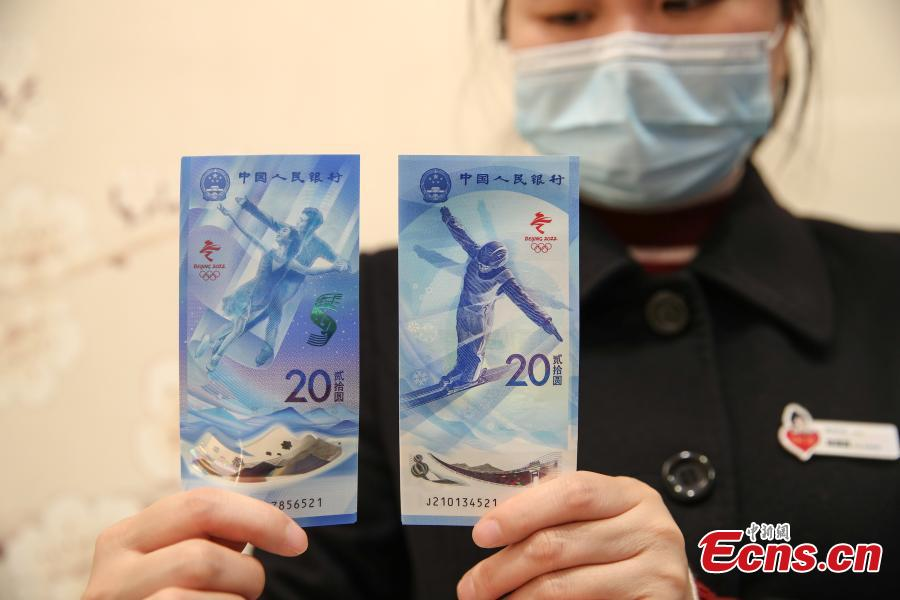
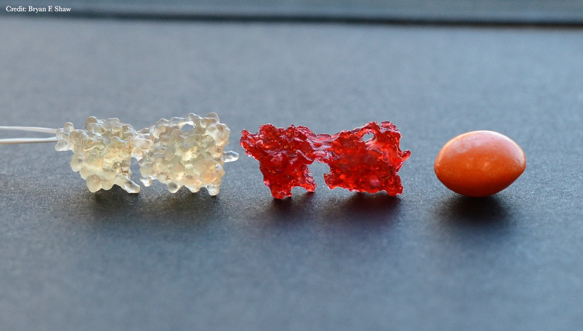

### 天空之眼大展身手
科学家使用500米孔径球形射电望远镜（[#FAST](https://twitter.com/hashtag/FAST?src=hashtag_click)），也被称为“中国天空之眼”，确定了509颗新脉冲星，是世界各地其他望远镜识别的脉冲星总数的四倍。

### Apple 将 Apple Maps 上的 3D 地标扩展到费城
iOS 15的新功能之一是苹果地图的3D体验，它将主要城市的详细地标分为三维。正如预期的那样，在最近扩展到华盛顿特区和圣地亚哥后，苹果现在正在将苹果地图中的3D地标扩展到费城。

苹果此前已确认，到2021年底，费城是获得苹果地图3D地标的城市之一。该功能最初仅在纽约和旧金山等几个城市推出，但现在该公司正在努力将这种体验带到更多地方。

该公司表示，详细地图将于明年扩展到加拿大的一些城市。

### 七珍七宝
9 月 13 日出生在中国西南重庆市动物园的熊猫兄弟姐妹举办了一个为期 100 天的派对，并于周二开始接待公众游客。他们的名字“七珍”和“七宝”合起来就是“宝贝”的意思。

### 50%的折扣
MacRumors和Flexibits本周合作，为读者提供了获得Flexibits Premium第一年50%的折扣的机会，其中包括流行的应用程序Fantastical和Cardhop。此优惠将在Flexibits网站上持续到12月31日，订阅支持macOS、iOS和iPadOS上的应用程序。优惠可在[官网](https://www.dpbolvw.net/click-462641-14534087?url=https%3A%2F%2Fflexibits.com%2Ffantastical%3Fcoupon%3DFbHbo8zu-oXotB69AQ8nq)上获取。

### 北京2022
周二，中国央行为2022冬奥会发行了一套纪念钞票。该套装包括一张聚合物纸条和一张纸条，分别以花样滑冰运动员和自由式滑雪运动员为特色。[来源](https://twitter.com/PDChina/status/1473317335071080451)

### iPhone 12 in India
据路透社报道，由于富士康一家工厂的食物中毒抗议，印度的iPhone 12生产已经停止。

在工人抗议后，富士康在印度南部钦奈附近的生产iPhone 12机型的制造工厂本周将继续关闭。据报道，抗议者封锁了通往该工厂的主要高速公路，以应对上周150名员工因食物中毒住院。据说，这一事件激怒了其他员工的担忧，这些担忧后来已向国家劳动部报告。

预计暂时关闭在短期内对苹果的影响最小，但它可能会对2022年提高产量产生影响。中断是在苹果的其他供应链限制下发生的，预计这些限制将在节假日季度恶化。该设施还为小米生产亚马逊Fire TV棒和一些设备。

今天早些时候，据报道，苹果计划在钦奈工厂生产iPhone 13机型，尽管iPhone 11和iPhone 12目前被认为是印地语最畅销的iPhone。[来源](https://www.reuters.com/world/india/exclusive-foxconn-plant-south-india-stay-shut-this-week-after-protests-govt-2021-12-21/)

### 嘴巴也能看见
来自[Science](https://www.science.org/journal/sciadv)的一篇论文指出，手持模型可帮助学生可视化 3D 对象，尤其是使用大型 3D 模型手动可视化图像的失明学生。 嘴巴具有比手更精细的触觉传感器，这可以使用便携式、廉价和一次性的微观模型来改善可视化。 嘴巴在触觉学习中仍未使用。 在这里，我们创建了来自“小熊软糖”明胶或无毒树脂的蛋白质分子的一口大小 3D 模型。 模型像米粒一样小，可以用味道编码，像糖果一样包装。 在识别特定结构时测试了嘴巴、手和视力。 学生通过嘴巴识别结构的准确率为 85.59%，类似于使用计算机动画通过视力进行识别。 40.91% 的学生口语结构回忆准确率高于手语，等于 31.82%，低于 27.27%。 一整套小巧、廉价、便携的模型的方便使用可以使学生更容易获得 3D 图像。[来源](https://www.science.org/doi/10.1126/sciadv.abh0691)

